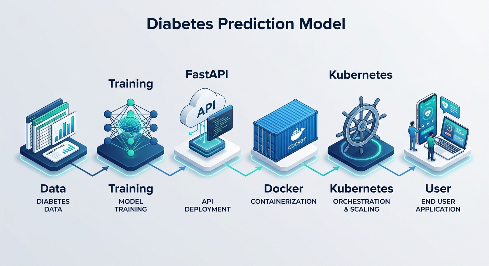

# 🩺 Diabetes Prediction Model – Your First MLOps Project
### 🚀 Scaling Machine Learning from Local Code to Kubernetes

This project demonstrates a complete end-to-end MLOps pipeline. We transition from a raw dataset to a production-ready, scalable API deployed on a Kubernetes cluster, predicting diabetes based on health metrics.

---

## 🏗️ Project Architecture

<!-- 
  IMAGE PLACEHOLDER: 
  Insert your generated diagram here. 
  Example: 
-->


---

## 🛠️ Tech Stack

| Category | Technology | Purpose |
| :--- | :--- | :--- |
| **Machine Learning** | `Scikit-Learn`, `Random Forest` | Model Training & Evaluation |
| **API Framework** | `FastAPI`, `Uvicorn` | High-performance Model Serving |
| **Containerization** | `Docker` | Environment Isolation & Portability |
| **Orchestration** | `Kubernetes (K8s)` | Scalability & Deployment Management |
| **Environment** | `Python 3.x`, `Venv` | Development Ecosystem |

---

## 📊 Problem Statement

The goal is to predict whether a patient has diabetes based on several diagnostic measurements:
- 🤰 **Pregnancies**: Number of times pregnant
- 🩸 **Glucose**: Plasma glucose concentration
- 🩺 **Blood Pressure**: Diastolic blood pressure (mm Hg)
- ⚖️ **BMI**: Body mass index (weight in kg/(height in m)^2)
- 📅 **Age**: Age in years

**Dataset:** Pima Indians Diabetes Dataset.

---

## 🚀 Getting Started

### 1. Environment Setup
```bash
# Clone the repository
git clone https://github.com/iam-veeramalla/first-mlops-project.git
cd first-mlops-project

# Create and activate virtual environment
python3 -m venv .mlops
source .mlops/bin/activate  # On Windows use: .mlops\Scripts\activate

# Install dependencies
pip install -r requirements.txt
```

### 2. Model Training
Train the Random Forest model and generate the `.pkl` file:
```bash
python train.py
```

### 3. Local API Execution
Launch the FastAPI server to test the model locally:
```bash
uvicorn main:app --reload
```

**Sample Request (`POST /predict`):**
```json
{
  "Pregnancies": 2,
  "Glucose": 130,
  "BloodPressure": 70,
  "BMI": 28.5,
  "Age": 45
}
```

---

## 📦 Deployment Pipeline

### 🐳 Dockerization
Package the API and model into a lightweight container:
```bash
# Build the image
docker build -t diabetes-prediction-model .

# Run the container
docker run -p 8000:8000 diabetes-prediction-model
```

### ☸️ Kubernetes Orchestration
Deploy the containerized application to a K8s cluster for high availability:
```bash
kubectl apply -f diabetes-prediction-model-deployment.yaml
```

---

## 🙌 Credits
Created by `ABHISHEK VEERAMALLA`
Check out more DevOps + MLOps content on the YouTube Channel: **Abhishek.Veeramalla**
